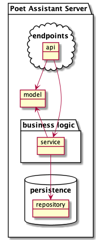

# Poet Assistant Server

This server contains a read-only embedded database with dictionaries for rhymes, synonyms/antonyms and definitions.

Refer to the [documentation](https://caarmen.github.io/poet-assistant-server)
for the list of endpoints and how to use them.

## Test it out
The app is available on heroku: https://poet-assistant-rest.herokuapp.com/

## Architecture
The app contains the following modules:

* Bottom:
  - `repository`: Accesses the database and exposes functions to retrieve Entities
* Top:
  - `api`: Defines the REST endpoints
* Middle:
  - `service`:  Contains the business logic required to map Entities to Model objects
* Other:
  - `doc`: Generates documentation
  - `app`: Contains the application class

The main branch is implemented in Kotlin with Spring Boot and Gradle.

There are other branches of this project, using other languages. They may not be as up-to-date as the main branch:
* [Scala](https://github.com/caarmen/poet-assistant-server/tree/scala)
* [Java](https://github.com/caarmen/poet-assistant-server/tree/java)
