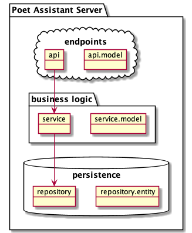

# Poet Assistant Server

This server contains a read-only embedded database with dictionaries for rhymes, synonyms/antonyms and definitions.

Refer to the [documentation](https://caarmen.github.io/poet-assistant-server)
for the list of endpoints and how to use them.

## Test it out
The app is available on heroku: https://poet-assistant-rest.herokuapp.com/

## Architecture
The app contains the following modules:

* Bottom:
  - `repository`: Accesses the database and exposes functions to retrieve Entities
* Top:
  - `model`: Provides the data classes (POJOs) which are serialized from/to json in requests/responses
  - `api`: Defines the REST endpoints
* Middle:
  - `service`:  Contains the business logic required to map Entities to Model objects
* Other:
  - `doc`: Generates documentation
  - `app`: Contains the application class

There's also [scala](https://github.com/caarmen/poet-assistant-server/tree/scala) branch with the project written in Scala. It may not be as up-to-date as the main branch.
